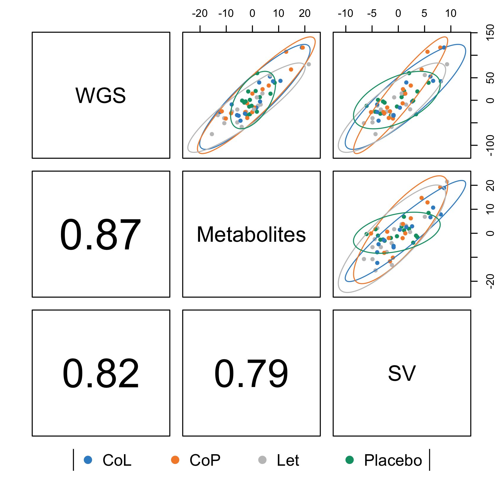

CLR_transform: WGS and Metabolite CLR related transformation and analyze
| Dataset | P-value | R^2 value |
| --------------- | --------------- | --------------- |
| WGS (Timepoint 2) | 0.038 | 0.195847 |
| WGS (Timepoint 5) | 0.068 | 0.1459338 |
| Metabolite (Timepoint 2) | 0.001 | 0.2807557 |
| Metabolite (Timepoint 5) | 0.021 | 0.1099516 | 
| 16s SV (Timepoint 2) | 0.024 | 0.1225239 |
| 16s SV (Timepoint 5) | 0.43 | 0.1122627 |

MixOmics: MixOmics DIABLO plot
  - Timepoint results
  
  - Treatment results
  
